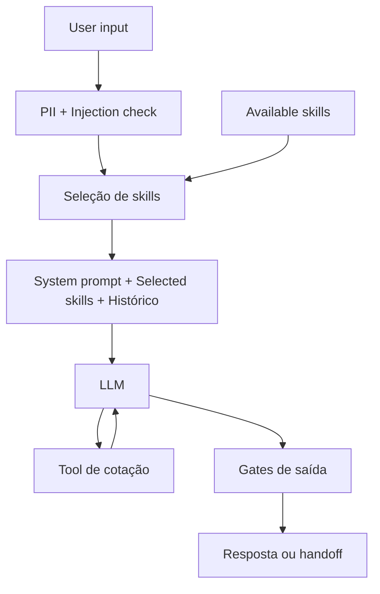

# AutoSeguro — agente de cotação de seguro auto

Agente que atende um lead de seguro auto pelo WhatsApp (simulado): conversa, qualifica,
cota via API instável e decide sozinho ou encaminha para um humano. Desafio take-home FDE
da Namastex. Plano completo, discovery e logs de IA em [`ai-logs/`](ai-logs/).

## Como rodar

```bash
git clone <este-repo> && cd autoseguro-agent
cp .env.example .env          # opcional: preencher OPENAI_API_KEY — sem chave, roda determinístico
docker compose up --build     # quote-api :8000 · agent-api :8080 · web :3000
```

Sem Docker (validado no ambiente de desenvolvimento, que não teve acesso a `sudo` a tempo):

```bash
cd vendor/namastex-fde-challenge/quote-service && uv run uvicorn app.main:app --port 8000 &
cd ../../.. && QUOTE_API_URL=http://localhost:8000 uv run uvicorn agent.api:app --port 8080 &
cd web && npm run dev
```

```bash
make test      # 219 testes, sem rede, sem OPENAI_API_KEY — roda em <1s
make eval      # 77 cenários determinísticos → evals/REPORT.md
make analyze   # reproduz a análise do dataset → evals/dataset_report.md
make demo      # log de uma execução completa → docs/demo/
```

---

## As decisões que tomei, e por quê

### Os cinco números que decidiram a arquitetura

Todos medidos contra o `quote-service` real, não assumidos.

| Número | O que significa | Decisão que ele causou |
|---|---|---|
| **0,304** | Taxa de falha por tentativa medida em 250 chamadas (bate com o previsto: 0,20 de erro + 0,10 de lentidão) | 3 tentativas → **97,3%** de sucesso |
| **0,9 ms / 8 s** | p50 de latência do caminho de sucesso vs. o caminho lento, que é `sleep(8)` fixo | **Timeout de 1,5s**, não 3s: qualquer valor entre ~100ms e 8s classifica igual, então minimizar corta o pior caso de 10,2s para 5,7s de graça |
| **15% vs 0,24%** | Chance de um circuit breaker abrir por engano com o serviço operando normal: janela deslizante 50%/10 vs. 5 falhas **consecutivas** | Breaker por **falhas consecutivas** — o default de metade dos tutoriais (janela) se auto-sabotaria |
| **0 de 1.749** | Conversas do dataset cujo preço bate com o que a API `/quote` calcula para o mesmo perfil (mediana 1,45x de diferença) | Dataset nunca é fonte de preço (BR-01); nunca vira few-shot de valor |
| **751 (30%)** | Leads do dataset que a API **recusa** (idade > 75 ou veículo > 20 anos) — e para os quais o vendedor humano cotou preço mesmo assim | Skill própria `underwriting_refusal` (BR-12): recusa de subscrição não é handoff, é desfecho direto |

Reproduzível: `make analyze` roda `scripts/analyze_dataset.py` e confere estes e outros 8
números (751/280/531/895/4.718/2.495/757/538/1.677) contra o dataset real, com `--check`
falhando se algo divergir.

### Por que gates em código, não só prompt (o coração do projeto)

> **O LLM é um componente não confiável. As regras críticas vivem em código.**

Um prompt bem escrito é defesa em profundidade, nunca a garantia. Por isso quatro funções
puras — `price_gate`, `coverage_gate`, `authority_gate`, `handoff_gate` (`agent/guards/`) —
rodam **sobre o texto que o modelo produziu**, antes do lead ver, sem LLM e sem rede:

- **`price_gate`**: sem cotação `200` bem-sucedida nesta conversa, qualquer valor monetário
  no rascunho (`R$ 200`, `duzentos reais`, `uns 190`) bloqueia. Com cotação, só os valores
  exatos que ela devolveu (prêmio, franquia, pro-rata) passam.
- **`coverage_gate`**: cobertura citada tem que pertencer ao plano cotado ou nomeado.
  Vocabulário fechado de 7 termos — não existe "cobertura inventada" que passe.
- **`authority_gate`**: desconto, "consigo baixar", "ajustar a franquia", "condição
  especial" bloqueiam **e forçam handoff**.
- **`handoff_gate`**: se o código decidiu que este turno precisa encaminhar, garante que a
  resposta realmente encaminhe (não continue vendendo).
- **`disclosure_gate`** (SEC-01, adicional aos 4 do prompt inicial): nomes de skill, trechos
  do system prompt e do catálogo interno não podem vazar na resposta.

No `BLOCK`: uma regeneração com instrução corretiva citando a regra violada; se falhar de
novo, uma resposta-template da skill correspondente — o texto violador **nunca** chega ao
lead. Cada decisão vira um evento `guard` no trace com `rule_id`. Isso é o que torna "o
agente não pode inventar preço" um invariante testável em milissegundos, sem chave de API —
não uma frase de boa vontade no prompt. Ver `evals/scenarios.py` (categoria `invariantes`):
um modelo roteirizado *de propósito* para violar cada regra, com a asserção sobre o efeito
entregue ao lead.

### Como isso responde ao requisito de prompt injection

O challenge não menciona injection em nenhum ponto; é requisito meu, e o dataset confirma
zero ocorrências de `ignore`/`esqueça`/`system prompt` nas 26.470 mensagens. Por isso a
aposta não foi num classificador sofisticado, e sim em três camadas, da mais forte à mais
fraca:

1. **Arquitetural** — o system prompt é uma constante montada de `business_rules.yaml`;
   nenhum caminho de código concatena texto do lead nele. O conteúdo do lead entra sempre em
   `role: user`, delimitado por `<lead_message>`. A tool `cotar_seguro` tem schema estrito de
   5 campos — **não existe parâmetro de preço ou desconto**, então o modelo é incapaz de
   setar um, injetado ou não.
2. **Gates de saída** — mesmo que o modelo seja completamente subvertido, ele não consegue
   emitir preço, cobertura ou desconto inválido (acima).
3. **Detecção** (`agent/security/injection.py`) — heurística determinística que classifica
   `benign | suspicious | injection` e anota o trace. **Não bloqueia a conversa**: falso
   positivo custa lead. `injection` neutraliza o trecho ofensor e endurece o turno; três
   ocorrências na mesma conversa forçam handoff.

`evals/scenarios.py` tem 15 ataques (override, falsa autoridade, exfiltração, escape de
delimitador, injection indireta via marcador de documento, envenenamento de argumento de
tool) + 5 controles (objeção real, insulto, pedido de desconto — nenhum desses pode virar
falso positivo). A métrica é **efeito bloqueado**, não acurácia do classificador.

### PII: sanitizador por entidade, não moderador de conteúdo

`agent/security/pii.py` mascara CPF (com dígito verificador), e-mail, telefone e placa em
duas camadas: **ingress** (antes do modelo montar o prompt) e **persistência** (todo dict que
vai para o trace passa pela mesma função). Isso é possível porque a `/quote` só aceita 5
campos e essas quatro entidades **nunca são necessárias** em nenhum ponto do fluxo.

CEP é diferente: vai em claro para o modelo (decide o agravo regional) e só o **prefixo**
(`01***-***`) é persistido — os 2 primeiros dígitos bastam para auditar o multiplicador
sem guardar o CEP completo. Insulto, reclamação e objeção passam **byte a byte**: é
sanitização de dado sensível, não filtro de conteúdo (`"seu sistema é uma porcaria"` sai
idêntico, só um CPF na mesma frase é mascarado).

### Skills: catálogo em markdown, seleção híbrida

`skills/*.md` — front-matter YAML + corpo. Regra comercial nunca em `.py` (há um teste que
faz `grep` disso). O catálogo (`available_skills`) é só o front-matter, sempre no contexto;
os corpos entram apenas quando selecionados. A seleção é híbrida porque dois requisitos
puxam em direções opostas: "o modelo seleciona pela intenção" e "o código garante as regras
críticas". Resolução: `always_on` e `event_triggered` são decididos por **código** — se o
breaker está aberto, `quote_failure` entra **mesmo que** o modelo tenha escolhido `quote`.
`model_selected` é escolhido pela intenção (roteador do LLM barato, com fallback por
palavra-chave se o roteador falhar).

Duas das oito skills não vieram do meu prompt original — foram derivadas de `plans.json`
durante o discovery: `underwriting_refusal` (30% dos leads do dataset) e
`coverage_explanation` (carência e pro-rata: **zero** menções nas 26.470 mensagens humanas,
logo um diferenciador que o agente cobre e o vendedor humano nunca cobriu).

### Resiliência: retry + circuit breaker, por classe de erro

`agent/tools/quote_client.py` classifica o erro pelo **corpo** da resposta, não pelo status
— porque `422` tem três significados diferentes na API mock (recusa real de subscrição,
`plano_id` inexistente, erro de schema Pydantic), e os dois últimos são bug do chamador, não
recusa ao lead. `agent/resilience/` faz o retry:

| Condição | Retry? | Conta pro breaker? |
|---|---|---|
| timeout / 5xx / 408 | sim, até 3x com backoff+jitter | sim |
| 429 | sim, 1x, honrando `Retry-After` | **contador separado** — nunca vira apagão geral |
| 400 / 401 / 403 | não | não |
| 422 recusa real (idade/veículo) | não — é desfecho de negócio | não |
| 422 plano inexistente / schema | não — é bug nosso | não |

Duas armadilhas só descobertas testando o serviço de verdade, não lendo o código:
**CEP inválido retorna `200`** com multiplicador de região neutro (sub-cota 30% em silêncio
para quem mora em área de agravo) — por isso a pré-validação do cliente rejeita CEP fora do
formato **antes** de chamar a rede; e **`data_inicio` em formato BR** (`15/07/2026`) retorna
`400 Invalid isoformat` — por isso a normalização acontece no cliente, nunca depende do
modelo acertar o formato.

### Trace: JSONL próprio, não LangWatch self-hosted

Avaliei LangWatch (requisito explícito): self-hosted são **7 serviços, 4 vCPU, 8 GB RAM, 20
GB de disco** — desproporcional para um desafio de 3 dias e para o requisito real, que é
"gravar trace e estado de conversa". O trace próprio (`agent/tracing/`, ~250 linhas) cobre
item por item: `conversation_id`/`message_id`, tool chamada, input sanitizado,
resultado/status, latência (inclusive em falha), erro tipado, skills e regras utilizadas —
um arquivo JSONL append-only por conversa, `jq`-friendly, sem infra. O exportador LangWatch
cloud (`agent/tracing/langwatch.py`) existe como **opcional**, desligado por padrão: sem
`LANGWATCH_API_KEY` é no-op silencioso, e quem avalia roda o repo sem criar conta em SaaS
nenhum.

### Sem banco

Estado de conversa em memória (`agent/state.py`, lock por conversa), trace em JSONL. O
requisito pede para evitar banco sem necessidade real, e "gravar trace + estado de conversa"
não precisa de um serviço a mais. Escape hatch declarado se um dia precisar de query
agregada: SQLite (stdlib, arquivo único) — nunca Postgres/Redis para este escopo.

---

## Fluxo dos dados



---

## Critério de handoff (explícito, por design)

| Gatilho | Regra | Detectado por |
|---|---|---|
| Lead pede atendente | BR-09 | palavra-chave + intenção |
| Cotação falha definitivamente (2º ciclo) | BR-10 | `quote_retries_exhausted` × 2 |
| Exige negociação, exceção ou desconto | BR-08 | `authority_gate` |
| Defeito interno (`422` ambíguo, `400`) | BR-08 | `InternalDefect` — **nunca** comunicado como recusa |
| Fora do escopo de seguro auto | BR-11 | skill `out_of_scope` |
| Injection reincidente (3ª vez na conversa) | BR-11 | `injection_scan` |

**Recusa de subscrição (idade > 75, veículo > 20 anos) não é handoff** (BR-12): é regra
dura da seguradora, sem o que negociar — vira uma skill própria (`underwriting_refusal`),
comunicada com clareza, sem preço, sem promessa de revisão. É o desfecho de **30% do
dataset**, e o vendedor humano do dataset errou isso 100% das vezes (cotou preço mesmo
assim).

## Rastreabilidade

`GET /conversations/{id}/trace` devolve o JSONL sanitizado; o painel do frontend (`web/`)
consome essa mesma rota com poll de 1,5s, agrupado por turno, com botão de exportação — é o
artefato do "log de uma execução completa". Dois exemplos versionados em
[`docs/demo/`](docs/demo/): caminho feliz (`happy-*`) e degradação total sem preço
(`degraded-*`, `QUOTE_FAILURE_RATE=1.0` simulado).

## Limitações declaradas

- **`price_gate`/`authority_gate` usam regex**: cobrem numerais escritos em pt-BR e os
  padrões óbvios de compromisso comercial, mas são evadíveis por paráfrase suficientemente
  criativa. O risco é conhecido e documentado, não escondido — a defesa real de primeira
  linha é a tool sem parâmetro de preço.
- **Sem autenticação** na API — decisão de escopo, não omissão; não pedido pelo desafio.
- **401/403/429 não existem no mock**: a política de retry para eles é código real, testada
  só com transporte fake (`evals/fake_transport.py`), nunca contra o serviço de verdade.
- **Docker não foi testado de ponta a ponta** neste ambiente de desenvolvimento: o socket do
  Docker exigia um `sudo` que não veio a tempo da sessão (grupo `docker` só se aplica em
  login novo). O `docker-compose.yml` foi escrito e revisado, e o equivalente funcional —
  `uv run uvicorn` para os dois serviços Python + `npm run dev` para o Next.js — foi
  validado ponta a ponta manualmente (cotação real, agravo de região confirmado
  numericamente). `npm run build` e `npm run typecheck` do frontend passam limpos.
- **`RuleBasedLLM`** (o modelo determinístico usado sem `OPENAI_API_KEY`) extrai campos por
  regex e não conduz uma conversa tão natural quanto um LLM real — ele existe para que
  `make test` e `make eval` rodem sem chave e sem rede, não para produção.

## Estrutura

```
agent/            orquestrador do turno, gates, resiliência, PII, injection, trace, API
skills/           regras de negócio em markdown (nenhuma em .py)
evals/            harness determinístico (77 cenários), análise do dataset, demo
vendor/           quote-service + dataset do challenge, vendorizados com atribuição
web/              Next.js: chat + painel de trace
docs/demo/        log de execução completa (E-04)
ai-logs/          discovery, arquitetura, tasks e logs de IA (E-05)
```

## Como usei IA

Claude Code (Opus 5, depois Sonnet 5) do discovery à entrega, em sessão contínua — log
íntegro em [`ai-logs/claude_logs/`](ai-logs/claude_logs/) (com uma nota sobre uma
redação de segurança necessária antes da publicação, documentada lá). Um subagente separado
implementou o frontend Next.js sob especificação de contrato de API. Wizard de HITL no
início do discovery decidiu provider (OpenAI), formato do frontend e política de publicação
dos logs — registrado em `ai-logs/README.md`.
